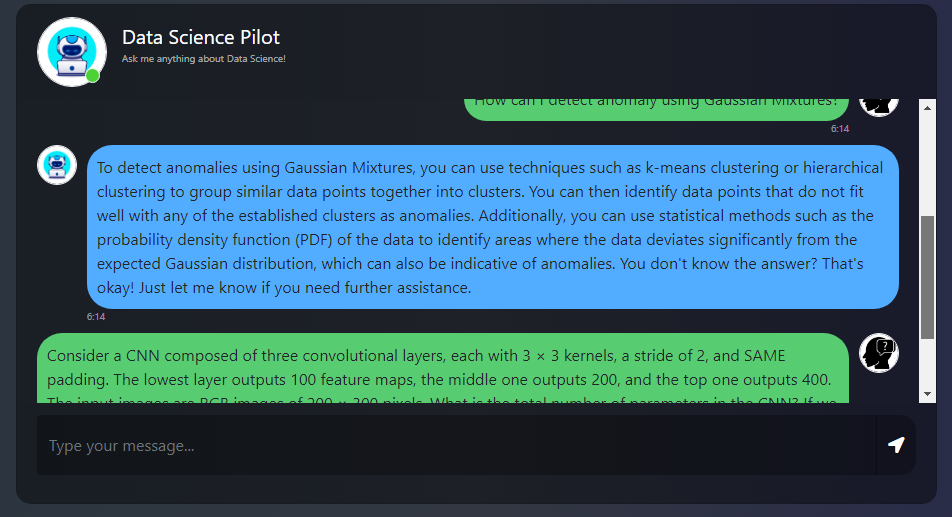

# 🤖 DataSciencePilot 🚀

DataSciencePilot is an innovative chat-based interface designed to interact with custom PDF files. It leverages the power of Pinecone for efficient vector database management and LLaMA-2 for advanced query response capabilities. This combination allows users to easily extract and analyze information from PDF documents through a conversational interface.

## Features ✨

- **Chat Interface**: Interact with your PDF files through a user-friendly chat interface.
- **Pinecone Integration**: Utilizes Pinecone's vector database for efficient data handling and retrieval.
- **LLaMA-2 Powered**: Harnesses the advanced natural language processing capabilities of LLaMA-2 for accurate and relevant responses.
- **PDF Support**: Seamlessly works with custom PDF files for data extraction and analysis.

## Getting Started 🚀

To get started with DataSciencePilot, follow these simple steps:

1. **Clone the Repository**: Clone this repository to your local machine.
   ```bash
   git clone https://github.com/kowshik24/DataSciencePilot.git

2. **Download the model**: Download the model from huggingface from here: https://huggingface.co/TheBloke/Llama-2-7B-Chat-GGML/blob/main/llama-2-7b-chat.ggmlv3.q4_0.bin then place it in the `model` folder. And on the `app.py` file change the model path to the path of the model you just downloaded.
   ```bash
   llm=CTransformers(model="model/llama-2-7b-chat.ggmlv3.q4_0.bin")
   ```

3. **Create a Virtual Environment**: Create a virtual environment using the following command:
   ```bash
   python3 -m venv env
   ```
4. **Activate the Virtual Environment**: Activate the virtual environment using the following command:
   ```bash
   source env/bin/activate
   ```
5. **Install Dependencies**: Install the required dependencies using the following command:
   ```bash
   pip install -r requirements.txt
   ```
6. **.env File**: Create a `.env` file in the root directory of the project and add the following environment variables:
   ```bash
   PINECONE_API_KEY=<your-pinecone-api-key>
   PINECONE_API_ENV=<your-pinecone-api-env>
   PINECONE_INDEX_NAME=<your-pinecone-index-name>
   ```
7. **Run the Application**: Run the application using the following command:
   ```bash
    python app.py
    ```
8. **Open the Application**: Open the application in your browser using the following URL:
    ```bash
    http://localhost:5120/
    ```

📹 Demo and Screenshots
---
📸 Screenshots

|  |  |
|:--------------------------------:|:--------------------------------:|
|     **Sample Visualization 1**   |     **Sample Visualization 2**   |
|  |  |


---
📞 Contact Information
For support, feedback, or contributions, please reach out to:

- 📧 **Email**: [kowshikcseruet1998@gmail.com](mailto:kowshikcseruet1998@gmail.com)
- 📱 **Phone**: 01706 896161
- 🌐 **Website**: [https://kowshik24.github.io/kowshik.github.io/](https://kowshik24.github.io/kowshik.github.io/)
- 🚀 **GitHub**: [Kowshik Deb Nath](https://github.com/kowshik24)
- 🤝 **LinkedIn**: [Kowshik Deb Nath](https://www.linkedin.com/in/kowshik-deb-nath-7a0a3a1a0/)
---